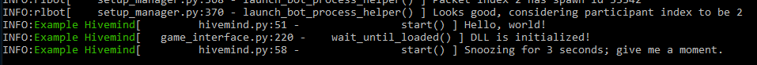

# Hivemind

Hivemind bots for [RLBot](rlbot.org).

## Python

To get started with your own hivemind in Python you will need these four things:

- a bot configuration file
- an appearance configuration file
- a dummy `DroneAgent`
- a `Hivemind` (subclass of `BotHelperProcess`)

### Bot configuration file

The bot configuration file must have the file ending `.cfg` and look something like this (for me this is the `config.cfg`):

```
[Locations]
# Path to loadout config. Can use relative path from here.
looks_config = ./appearance.cfg

# Path to python file. Can use relative path from here.
python_file = ./hive.py

# Name of the bot in-game
name = Drone

[Bot Parameters]
# Relative path to the hivemind file
hivemind_path = ./hive.py

# Name of your hivemind that shows up in the console
hivemind_name = Example Hivemind

# Bots with the same key will be part of the same hivemind
hivemind_key = ChangeThisKey

[Details]
# These values are optional but useful metadata for helper programs
# Name of the bot's creator/developer
developer = 

# Short description of the bot
description = 

# Fun fact about the bot
fun_fact = 

# Link to github repository
github = 

# Programming language
language = python
```

You'll notice the three unusual entries under `[Bot Parameters]`:

- `hivemind_path` points towards the main hivemind file containing a `Hivemind` subclass. It's important to note that this is not necessarily the same as the `python_file`. The `python_file` points to the file containing a `DroneAgent` subclass. You could have the `DroneAgent` in a separate file like `drone.py`.
- `hivemind_name` determines the name that shows up in the console. 
- `hivemind_key` matches up agents with the same key into one hivemind. Your key should be **unique** so that when two hiveminds meet there is no confusion over 
which bot is whose.

### Appearance configuration file

The appearance file is just a normal appearance file. See [the rlbot wiki](https://github.com/RLBot/RLBot/wiki/Bot-Customization) for more info.

### Dummy DroneAgent

RLBot needs an agent to request the hivemind (`BotHelperRequest`). This is done using a `BaseIndependentAgent`. I abstracted away all the hassle of making a request with `DroneAgent`. All you need now is just to subclass it like this:

```python
class Drone(DroneAgent):
    pass
```

Then, you need `python_file` in your bot configuration file to point towards the file with this `DroneAgent` subclass. (It can even be in your hivemind file in which case `python_file` will be the same as `hivemind_path` like in my example code).

### Hivemind

The hivemind is where all your bot logic goes. The `Hivemind` is a subclass of `BotHelperProcess`. When the drones request a hivemind, a process is created with the unique key if one doesn't already exist with that key. This process is your hivemind and it has control over the drones that requested it.

Here's a basic template for what a hivemind looks like:

```python
class MyHivemind(Hivemind):

    def initialize_hive(self, packet: GameTickPacket) -> None:
        pass

    def get_outputs(self, packet: GameTickPacket) -> Dict[int, PlayerInput]:
        return {index: PlayerInput() for index in self.drone_indices}
```

You will notice that is not unlike a standard Python bot. Instead of `initialize_agent` and `get_output` methods we have `initialize_hive` and `get_outputs` methods. 

The `initialize_hive` method is for any code that you want to run before any `get_outputs` calls. It differs from `initialize_agent` in that you also get access to the packet because it is convenient to have when initializing objects. I recommend you use it for something like creating objects for each of your drones, the ball, and other cars.

`get_outputs` gets called every time a new packet arrives (Does not use a rate limiter). It differs from `get_output` in the expected return. Since `get_output` only determines the controls for one car, it only returns a single controller state. A hivemind controls more bots, so we use a dictionary, where the keys are drone indices, and the values are `PlayerInput`s. `PlayerInput` is basically the same as `SimpleControllerState` for our use case, but it saves us from having to convert an additional time.

`self.drone_indices` is a set of bot indices which your hivemind controls.

Normally, a `BotHelperProcess` would have to use `GameInterface` methods to access things like ball prediction or rendering. These methods have been wrapped to be just like normal Python bot methods.

Without wrapper:
```python
# In initialization:
self.ball_prediction = BallPrediction()
# In main loop:
self.game_interface.update_ball_prediction(self.ball_prediction)
```

With wrapper:
```python
self.ball_prediction = self.get_ball_prediction_struct
```

### How does it work?

See `drone_agent.py` for the `DroneAgent` code and `hivemind.py` for `Hivemind` inside the `python/hivemind_source/` directory. 

Ask @Calculated_Will#4544 on Discord if you have further questions.

## Other Languages

**TODO**